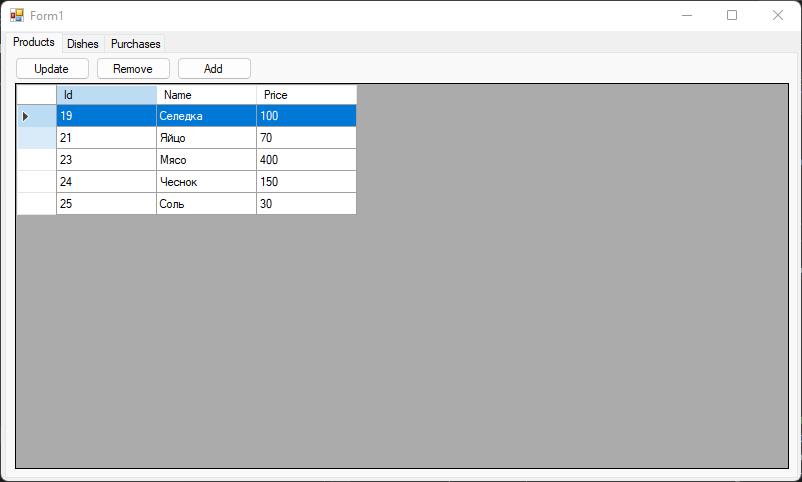
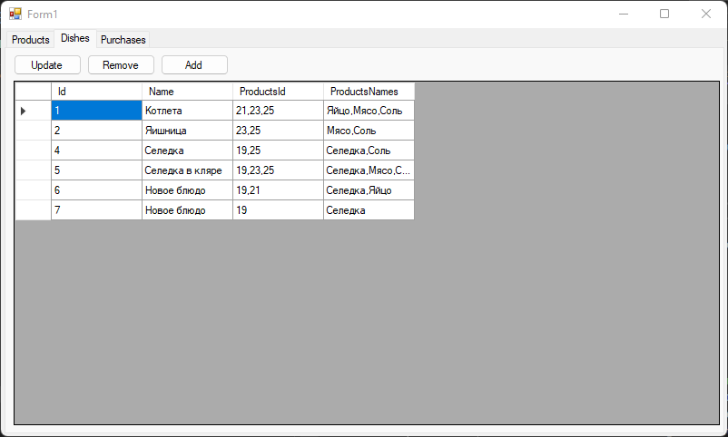
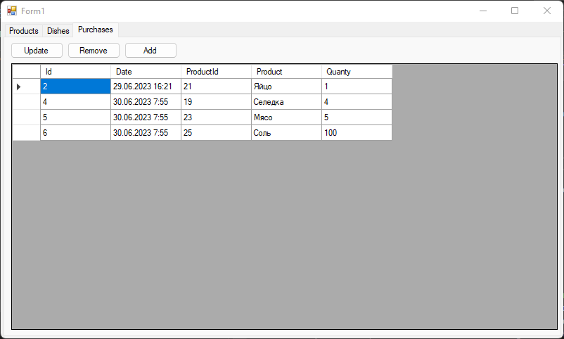

### Скриншоты

Данный код представляет собой часть приложения Windows Forms, которое работает с базой данных в рамках сущностей Entity Framework. Он содержит форму `Root`, которая представляет основное окно приложения.

Краткое описание основных элементов кода:

1. `Root` - класс формы, который наследуется от `Form` и представляет основное окно приложения.

2. `dbContext` - объект контекста базы данных, созданный на основе класса `EateryEntities`. Контекст предоставляет доступ к данным в базе данных через Entity Framework.

3. `ProductsViewModel` - модель представления для продуктов. Она содержит свойства `Id`, `Name` и `Price`, которые используются для отображения данных о продуктах.

4. `UpdateProducts` - метод, который обновляет список продуктов на основе данных из базы данных и отображает их в DataGridView с помощью связывания данных.

5. `productsUpdateClick` - обработчик события клика на кнопку "Обновить продукты". Вызывает метод `UpdateProducts` для обновления списка продуктов.

6. `productsEdit` - обработчик события окончания редактирования ячейки в DataGridView с продуктами. Получает индекс редактируемой ячейки, значение, введенное пользователем, и ID продукта. Затем обновляет соответствующее свойство объекта данных `Product` и сохраняет изменения в базе данных.

7. `productDelete_Click` - обработчик события клика на кнопку "Удалить продукт". Проверяет, есть ли выбранная строка в DataGridView, получает ID выбранного продукта и удаляет соответствующий объект `Product` из базы данных.

8. `AddProduct_Click` - обработчик события клика на кнопку "Добавить продукт". Создает новый объект `Product` с заданными значениями для имени и цены, добавляет его в базу данных и сохраняет изменения.

9. `PurchaseViewModel` - модель представления для покупок. Она содержит свойства `Id`, `Date`, `ProductId` и `Product`, которые используются для отображения данных о покупках.

10. `UpdatePurchasesF` - метод, который обновляет список покупок на основе данных из базы данных и отображает их в DataGridView с помощью связывания данных.

11. `UpdatePurchases_Click` - обработчик события клика на кнопку "Обновить покупки". Вызывает метод `UpdatePurchasesF` для обновления списка покупок.

12. `RemovePurchases_Click` - обработчик события клика на кнопку "Удалить покупку". Проверяет, есть ли выбранная строка в DataGridView, получает ID выбранной покупки и удаляет соответствующий объект `

### Определенные приемы и практики, которые используются в данном коде, включают:

1. Использование паттерна проектирования MVVM (Model-View-ViewModel): В коде применяется разделение модели представления (`ProductsViewModel` и `PurchaseViewModel`) от представления (`DataGridView`) и модели (`Product` и `Purchase`). MVVM помогает разделить логику приложения от его визуального представления и упрощает тестирование и поддержку кода.

2. Связывание данных (Data Binding): Для отображения данных из модели представления в DataGridView используется связывание данных. Это позволяет автоматически обновлять представление при изменении данных в модели и упрощает управление данными.

3. Обработка событий пользовательского ввода: В коде используются обработчики событий, такие как клик на кнопку или окончание редактирования ячейки в DataGridView. Обработчики событий позволяют реагировать на действия пользователей и выполнять соответствующие операции, такие как обновление данных, добавление или удаление элементов.

4. Использование Entity Framework: Код взаимодействует с базой данных с помощью Entity Framework. Entity Framework предоставляет удобный способ работать с данными базы данных, а ORM-подход позволяет работать с данными в виде объектов, что облегчает их использование и обновление.

5. Использование LINQ (Language-Integrated Query): LINQ используется для выполнения запросов к базе данных и выборки данных. LINQ предоставляет удобный и выразительный способ работать с данными и позволяет использовать синтаксис похожий на SQL запросы.

6. Использование LINQ to Entities: В коде применяется LINQ to Entities для выполнения запросов к базе данных через Entity Framework. LINQ to Entities позволяет выполнять запросы и фильтрацию данных на стороне базы данных, что повышает производительность и уменьшает объем переносимых данных.

7. Использование CRUD-операций: Код включает операции CRUD (Create, Read, Update, Delete) для работы с данными. Операции CRUD позволяют добавлять, читать, обновлять и удалять данные в базе данных.

8. Использование объекта контекста базы данных: Код создает экземпляр объекта контекста базы данных (`dbContext`) для взаимодействия с базой данных. Контекст базы данных предоставляет доступ к таблицам и сущностям базы данных и управляет изменениями данных.

9. Использование кнопок и элементов управления Windows Forms: Для взаимодействия с пользователем

 в коде используются кнопки, текстовые поля и другие элементы управления Windows Forms. Элементы управления позволяют пользователю вводить данные, выбирать опции и выполнять действия.

Это лишь некоторые из приемов и практик, применяемых в данном коде. В реальных проектах могут использоваться и другие приемы в зависимости от требований и особенностей приложения.